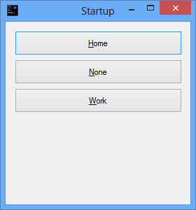

#Startup Selector

I use my PC at work and at home, but i don't use the same programs at home as i do at work.

**StartupSelector** is an application that presents you with a choice of profiles to use for startup programs when the computer starts.

Create a folder to hold your profiles, and a folder for each profile:

    Profiles
    |-- Home
    |-- Work
    `-- None

The capital letter in the profile folder name is used as the mnemonic shortcut for the file (Alt+&lt;Key&gt;).

Place shortcuts in the profiles folders that should be started for the specific profile.

You can specify which folder to use as the profiles folder in the `app.config` file.

## Example: 

My `Work` folder currently contains the following items:

    DPMClient.lnk
    KeePass.lnk
    Lync.lnk
    Outlook 2013.lnk
    procrastitracker.lnk
    
while my `Home` folder currently contains:

    Dropbox.lnk
    KeePass.lnk
    Skype.lnk
    
I let Windows handle the programs that should always start.